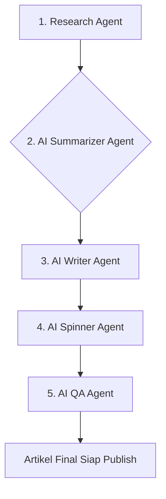

# Desain Flow Artikel Modern (v1.4.0)

**Tujuan:** Mengatasi masalah Research Agent yang stuck, meningkatkan kualitas artikel secara signifikan, dan mencapai target 1000-3000 kata dengan flow yang lebih modern dan teliti.

## Flow Pipeline Baru

Flow yang lama (Research -> 5 AI Writers -> QA) akan diganti dengan flow baru yang lebih sekuensial dan logis, meniru cara kerja tim editorial manusia.

### 1. Research Agent (Diperbaiki)
- **Masalah:** Stuck saat scraping.
- **Solusi:**
    - Implementasi **timeout 20 detik** untuk setiap request HTTP.
    - Menambahkan **error handling** yang lebih robust untuk status code non-200, konten kosong, atau error cURL.
    - Menambahkan **logging** yang lebih detail untuk setiap URL yang di-scrape (berhasil atau gagal).
- **Output:** `research_pack` (JSON berisi teks mentah dari 8 sumber).

### 2. AI Summarizer Agent (Baru)
- **Tugas:** Membaca semua data mentah dari `research_pack` dan menyatukannya menjadi satu dokumen riset yang koheren dan terstruktur.
- **Prompt Inti:**
  > "Anda adalah seorang asisten riset ahli. Di bawah ini adalah kumpulan data mentah yang di-scrape dari berbagai sumber tentang **{topic}**. Tugas Anda adalah membaca, memahami, dan mensintesis semua informasi ini menjadi satu dokumen riset yang komprehensif dan terstruktur. Ekstrak semua fakta kunci, data (harga, lokasi, jam buka), konteks sejarah, tips praktis, dan poin-poin penting lainnya. Buang semua noise, iklan, dan teks yang tidak relevan. Organisasikan informasi secara logis dengan sub-judul yang jelas. Outputnya harus berupa ringkasan riset yang bersih dan faktual yang dapat digunakan oleh seorang penulis untuk membuat artikel lengkap. Jangan menulis artikelnya, hanya buat ringkasan risetnya."
- **Output:** `summary_document` (Teks Markdown terstruktur).

### 3. AI Writer Agent (Diperbaiki)
- **Tugas:** Menerima `summary_document` dan menulis artikel baru yang lengkap (1000-3000 kata) seolah-olah membaca ringkasan riset tersebut.
- **Prompt Inti:**
  > "Anda adalah seorang penulis konten travel profesional untuk **sekali.id**. Anda telah diberikan sebuah ringkasan riset yang komprehensif tentang **{topic}**. Tugas Anda adalah menulis artikel baru yang original, menarik, dan mendalam dengan panjang 1000-3000 kata, hanya berdasarkan informasi dari ringkasan yang diberikan. Tulis dengan gaya bahasa yang natural dan manusiawi. Mulai artikel dengan branding 'sekali.id akan menyuguhkan...'. Jangan hanya menyalin dari ringkasan; interpretasikan datanya dan sajikan dengan gaya penulisan khas Anda. Buat narasi yang mengalir dan berikan wawasan yang berharga bagi pembaca."
- **Output:** `draft_content` (Teks artikel mentah).

### 4. AI Spinner Agent (Diperbaiki)
- **Tugas:** Menerima `draft_content` dan melakukan spinning pada setiap paragraf untuk memastikan keunikan dan gaya bahasa yang lebih natural.
- **Prompt Inti:**
  > "Anda adalah seorang editor ahli. Tulis ulang setiap paragraf dari teks berikut ini menggunakan sinonim dan struktur kalimat yang berbeda, namun tetap mempertahankan makna dan informasi aslinya. Pastikan hasilnya terdengar natural dan tidak kaku. Jaga keyword utama tetap ada."
- **Output:** `spun_content` (Teks artikel yang sudah di-spin).

### 5. AI QA Agent (Diperbaiki)
- **Tugas:** Menerima `spun_content` dan melakukan polishing akhir.
- **Fungsi:**
    - Memeriksa dan memperbaiki tata bahasa dan ejaan.
    - Memastikan branding `sekali.id` sudah benar.
    - Menambahkan internal link (jika belum ada).
    - Memastikan struktur artikel (judul, intro, body, conclusion) sudah baik.
    - Melakukan SEO check akhir (keyword density, dll).
- **Output:** `final_content` (HTML artikel yang siap dipublikasikan).

## Perubahan Lain
- **Database:** Tabel `tsa_jobs` akan ditambahkan kolom baru: `summary_pack` (TEXT) untuk menyimpan hasil dari AI Summarizer.
- **Queue:** `class-queue.php` akan diupdate untuk mengakomodasi langkah-langkah baru dalam flow ini.
