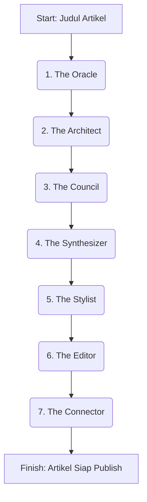

# Project Hyperion: Arsitektur & Flow Artikel Futuristik

**Versi:** 2.0
**Status:** In Development

## Filosofi Inti

Project Hyperion adalah evolusi dari sistem pembuatan artikel, beralih dari agregasi konten menjadi **jurnalisme digital berbasis AI**. Tujuannya adalah untuk menghasilkan artikel yang tidak hanya SEO-friendly, tetapi juga sangat informatif, mendalam, dan memukau pembaca, sesuai dengan standar **Google Helpful Content**.

## Arsitektur 7 Tahap

Flow ini terdiri dari 7 agent yang bekerja secara sekuensial, di mana output dari satu agent menjadi input untuk agent berikutnya.

### Tahap 1: The Oracle (Quantum Research & Entity Extraction)

- **Input**: Judul Artikel (string)
- **Misi**: Melakukan riset mendalam dari top 20 hasil pencarian Google dan membangun "Peta Pengetahuan" (Knowledge Graph).
- **Proses**:
    1.  Scrape konten dari 20 URL teratas.
    2.  Gunakan AI untuk melakukan **Named Entity Recognition (NER)** untuk mengidentifikasi entitas seperti: Lokasi, Harga, Nama Orang, Organisasi, Tanggal, dll.
    3.  Lakukan **Analisis Sentimen** untuk setiap fakta atau opini yang ditemukan.
    4.  Strukturkan semua data menjadi sebuah **Knowledge Graph** dalam format JSON.
- **Output**: `knowledge_graph.json` (berisi entitas, fakta, sentimen, dan sumber).

### Tahap 2: The Architect (Narrative Design & Dynamic Outline)

- **Input**: `knowledge_graph.json`
- **Misi**: Merancang *blueprint* atau kerangka artikel yang dinamis dan unik, meniru struktur artikel page-one.
- **Proses**:
    1.  Analisis `knowledge_graph.json` untuk memahami topik utama dan sub-topik.
    2.  Tentukan struktur heading (H1, H2, H3) yang paling logis dan komprehensif.
    3.  Tentukan di mana harus menempatkan **bold**, *italic*, tabel, dan list untuk penekanan dan keterbacaan maksimal.
- **Output**: `article_blueprint.json` (struktur heading, paragraf, dan instruksi formatting).

### Tahap 3: The Council (Multi-Perspective Content Synthesis)

- **Input**: `knowledge_graph.json`, `article_blueprint.json`
- **Misi**: Menulis draf konten dari berbagai sudut pandang menggunakan 5 AI dengan persona berbeda.
- **Proses**:
    1.  Bagi tugas penulisan setiap section dari `article_blueprint.json` ke 5 AI:
        - **AI #1 (Storyteller)**: Fokus pada narasi, sejarah, dan latar belakang.
        - **AI #2 (Analis)**: Fokus pada data, fakta, dan analisis mendalam.
        - **AI #3 (Pemandu Praktis)**: Fokus pada tips, tutorial, dan informasi praktis.
        - **AI #4 (Ahli Lokal)**: Fokus pada insight unik, kuliner, dan budaya lokal.
        - **AI #5 (Ahli Strategi SEO)**: Fokus pada kesimpulan, FAQ, dan optimasi keyword.
- **Output**: `draft_council.json` (berisi 5 draf terpisah untuk setiap section).

### Tahap 4: The Synthesizer (Cohesive Narrative Weaving)

- **Input**: `draft_council.json`
- **Misi**: Menyatukan 5 draf dari The Council menjadi satu artikel yang kohesif dan mengalir mulus.
- **Proses**:
    1.  Baca semua draf.
    2.  Gabungkan poin-poin terbaik dari setiap AI.
    3.  Tulis ulang kalimat dan paragraf untuk memastikan gaya bahasa konsisten dan tidak ada pengulangan.
- **Output**: `draft_synthesized.md` (draf artikel tunggal dalam format Markdown).

### Tahap 5: The Stylist (Semantic HTML & Rich Formatting)

- **Input**: `draft_synthesized.md`, `article_blueprint.json`
- **Misi**: Menerapkan formatting kaya (bold, italic, tabel, list) sesuai dengan blueprint.
- **Proses**:
    1.  Parse draf Markdown.
    2.  Terapkan tag `<strong>` untuk **bold**, `<em>` untuk *italic*.
    3.  Konversi data yang relevan menjadi `<table>`.
    4.  Konversi tips atau langkah-langkah menjadi `<ul>` atau `<ol>`.
- **Output**: `draft_styled.html` (draf artikel dalam format HTML lengkap).

### Tahap 6: The Editor (Human-like Polish & SEO Audit)

- **Input**: `draft_styled.html`
- **Misi**: Melakukan sentuhan akhir seperti editor manusia dan audit SEO.
- **Proses**:
    1.  Baca ulang keseluruhan artikel untuk memperbaiki tata bahasa dan alur.
    2.  Jalankan melalui AI checker dan lakukan parafrase jika perlu.
    3.  Audit kepadatan keyword, meta description, dan elemen SEO on-page lainnya.
- **Output**: `final_draft.html` (artikel yang sudah dipoles dan siap publish).

### Tahap 7: The Connector (Smart Internal & External Linking)

- **Input**: `final_draft.html`
- **Misi**: Menambahkan link internal dan eksternal yang relevan secara strategis.
- **Proses**:
    1.  Scan database untuk artikel lain yang relevan di website.
    2.  Sisipkan 3-5 link internal secara natural di dalam konten.
    3.  Cari 1-2 sumber eksternal terpercaya (non-kompetitor) untuk dijadikan referensi.
- **Output**: `final_article.html` (artikel final dengan semua link terpasang).
